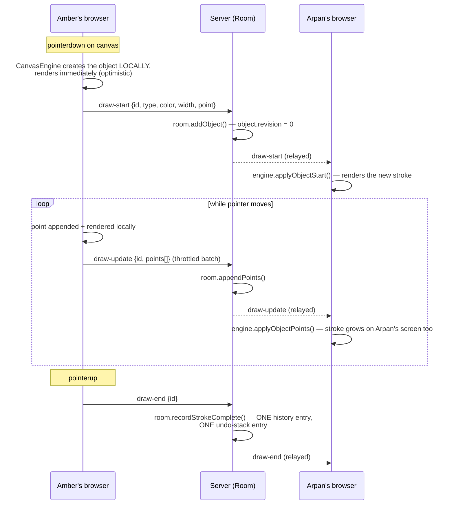

# SyncCanvas — Architecture

This document describes the **actual implementation** in this repository, not an
aspirational design. File paths point at the real code.

## 1. System architecture

```
┌─────────────────────────────┐        Socket.IO         ┌──────────────────────────────┐
│           CLIENT             │◄────────────────────────►│            SERVER             │
│  (vanilla JS, Vite-bundled)  │        (WebSocket)        │      (Node + Socket.IO)       │
│                               │                            │                                │
│  main.js (tiny router)        │                           │  index.js (Express + HTTP +    │
│    └─ ui/home.js               │                          │   Socket.IO server)            │
│    └─ ui/room.js  ─────────────┼── orchestrates ──────────┤                                │
│         ├─ canvas/engine/       │                          │  socket/handlers.js            │
│         │   CanvasEngine.js     │  (all real logic,        │   (validates every payload,    │
│         │   (owns canvas,       │   framework-agnostic)    │    delegates to Room)          │
│         │   pointer/keyboard     │                          │                                │
│         │   input, viewport,     │                          │  rooms/RoomManager.js          │
│         │   render loop)         │                          │   (roomId -> Room instance)    │
│         ├─ canvas/rendering/     │                          │                                │
│         │   Renderer.js          │                          │  rooms/Room.js                 │
│         ├─ canvas/geometry/      │                          │   (users, objects, GLOBAL      │
│         │   (pure hit-test/      │                          │    undo/redo stack, per-room   │
│         │   bounds/snap math)     │                          │    revision counters)          │
│         ├─ collaboration/         │                          │                                │
│         │   RoomConnection.js     │                          │  rooms/RoomHistory.js          │
│         │   (engine <-> socket     │                          │   (Phase 9 replay log)         │
│         │   bridge)                │                          │                                │
│         ├─ store/*.js (plain       │                          │  rooms/RoomLocks.js            │
│         │   observable state,      │                          │   (soft locks + control        │
│         │   see utils/store.js)     │                          │    requests, TTL-based)        │
│         └─ ui/topbar.js,            │                          │                                │
│             toolbar.js, minimap.js   │                         └──────────────────────────────┘
│             (DOM, subscribes to       │
│             stores + engine events)    │
└─────────────────────────────┘
              │
              ▼
      shared/ (pure JS: event names, limits, validators — imported
      by BOTH sides so they can never drift on wire format)
```

**Key design choice: server-authoritative, no CRDT/OT.** Node's Socket.IO server
processes every event for a given room strictly one at a time (JavaScript's
single-threaded event loop + one `Room` object per room). That total ordering is what
makes a plain "last write wins, with revision checks" model *correct* without needing
Operational Transform or a CRDT: there is never a moment where two operations are
applied "simultaneously" on the server, only ever in some well-defined sequence.

**Key design choice: the canvas engine is framework-agnostic.** `CanvasEngine`
(`client/src/canvas/engine/CanvasEngine.js`) is a plain `EventTarget` subclass that owns
the `<canvas>`, all pointer/keyboard input, the viewport, and the render loop. It never
imports any UI code — the vanilla JS UI layer (`client/src/ui/`) only talks to it through
a handful of imperative methods (`engine.setTool(...)`, `engine.zoomBy(...)`, ...) and by
listening for `CustomEvent`s it dispatches (`'local-object-update'`,
`'object-count-change'`, ...). This is *why* the Phase 13A migration from React to
vanilla JS touched almost none of the canvas/collaboration/document logic — only the UI
layer that was rendering it needed to change.

## 2. Data flow diagram

A single stroke, end to end:



## 3. Canvas rendering strategy

Every object (stroke, shape, connector, sticky note, frame) is a plain JS object in one
`Map<id, object>` (`CanvasEngine.objects`) — object insertion order *is* z-order, so there
is no separate `zIndex` field to keep in sync.

- **Dirty-flag rendering**: `CanvasEngine.markDirty()` sets a flag; the `requestAnimationFrame`
  loop (`_loop()`) only calls `Renderer.render()` when that flag is set, and clears it
  right after. An idle canvas costs nothing per frame.
- **One render pass, one function per object type**: `drawObject()`
  (`client/src/canvas/rendering/drawObject.js`) dispatches on `object.type` to a
  small, focused draw function (`drawPath`, `drawRect`, `drawConnector`, ...), reused
  identically by the live canvas, the mini-map (a simplified version), and PNG export —
  so "what a shape looks like" is never defined twice.
- **Rotation** is applied as a canvas transform around the object's own center at draw
  time (`Renderer.js`'s `withObjectRotation`), never baked into the stored `points` — the
  same transform is reused for hit-testing (`hitTest.js` inverse-rotates the query point
  into the object's local frame instead of teaching every shape's hit-test about rotation).
- **Hit-testing/selection** (`canvas/geometry/hitTest.js`, `resizeHandles.js`) and
  **spatial indexing** (`canvas/geometry/spatialHash.js`, a uniform grid rebuilt once at
  drag-start) are pure functions over the object map — no DOM, independently unit-tested.
- All of this is **hand-written against `CanvasRenderingContext2D`** — no Fabric/Konva/
  Paper.js/etc.

## 4. WebSocket protocol (actual events)

Defined once in `shared/constants/events.js`, imported by both sides. Grouped by
category (event name → payload):

**Connection / presence**
| Event | Direction | Payload |
|---|---|---|
| `join-room` | client→server (ack) | `{roomId, username, userId}` → `{ok, selfId, roomId, users, objects, locks}` |
| `user-joined` / `user-left` | server→room | `{user}` / `{userId}` |
| `cursor-move` / `cursor-update` | client→server / server→room | `{x,y}` / `{userId,x,y}` |
| `ping` / `pong` | round-trip latency probe | timestamp |

**Drawing (streamed while the pointer moves)**
| Event | Payload |
|---|---|
| `draw-start` | `{id, type, color, width, point, ...fill fields}` |
| `draw-update` | `{id, points: [...]}` — only the NEW points since the last flush |
| `draw-end` | `{id}` — marks the stroke complete (this is when it becomes ONE history/undo entry) |

**Editing (existing objects)**
| Event | Payload |
|---|---|
| `object-update` | single-object style patch `{id, patch, baseRevision}` |
| `batch-update` | N-object transaction (move/resize/align/group/...) `{patches[], opType}` |
| `objects-create` / `objects-delete` | paste/duplicate / multi-delete, atomic |
| `reorder-objects` | layer order change `{ids, op}` |
| `clear-canvas` | wipes the room |
| `import-document` / `document-imported` | whole-document replace (JSON import, restore, crash recovery) |
| `undo` / `redo` | no payload — server looks up the room's **global** stack |
| `update-rejected` | server→sender only: stale revision or lock conflict, with the authoritative object to reconcile against |

**Ephemeral (never touch persistent state)**
| Event | Payload |
|---|---|
| `laser-move` | presenter-style pointer, fades client-side |
| `viewport-update` | `{x,y,scale}` — powers remote-cursor-in-context, mini-map dots, and "Follow" |
| `selection-change` | `{objectIds}` — for showing "who's selecting what" |
| `transform-preview` | live in-progress drag/resize geometry, pre-commit |

**Locks / conflict safety**
| Event | Payload |
|---|---|
| `objects-lock-request` (ack) / `objects-lock-release` | `{objectIds}` |
| `object-lock-granted` / `object-lock-released` | `{objectIds, userId?, reason?}` |
| `object-lock-heartbeat` | TTL refresh for held locks |
| `request-control` / `control-requested` / `control-response` / `control-granted` / `control-denied` | the "X is editing this — request control" takeover flow |

**History (Phase 9 — separate from undo/redo)**
| Event | Payload |
|---|---|
| `get-history` (ack) | fetch the room's full operation log for replay/timeline |
| `create-checkpoint` / `checkpoint-created` | named, shared snapshots |
| `restore-version` | jump the live document to a historical point (itself a new, forward-recorded operation — never truncates history) |

Full event list: [`shared/constants/events.js`](shared/constants/events.js). Every
handler in [`server/src/socket/handlers.js`](server/src/socket/handlers.js) validates its
payload against [`shared/validation/validators.js`](shared/validation/validators.js)
before touching room state, and every handler destructures with a `= {}` default (or an
explicit null-check) so a missing/malformed payload is rejected, never thrown on.

## 5. Real-time stroke streaming

Strokes are **not** sent as one message on pointer-up. While the pointer is down:

1. `CanvasEngine._onPointerMove` appends each accepted point to the object **locally**
   and re-renders immediately (this is what "immediate local rendering" means below).
2. New points are queued (`pendingOutgoingPoints`) and flushed as a `draw-update` batch,
   throttled to roughly the draw rate limit rather than one message per `pointermove`
   (`DRAW_RATE_LIMIT_MS` server-side; the client naturally batches whatever accumulated
   since the last flush).
3. Points closer than ~2.5 world units to the last *accepted* point are dropped
   entirely (`shouldAcceptPoint`), so a slow, wobbly stroke isn't recorded far finer than
   it's ever rendered.
4. The server appends those points to its own copy of the object
   (`Room.appendPoints`) and relays `draw-update` to everyone else in the room, who apply
   it the same way — the stroke visibly *grows* on remote screens while you're still
   drawing it, not just once you lift the pen.

## 6. Client-side prediction (optimistic UI)

Every mutating action applies to the local `CanvasEngine.objects` map **immediately**,
before the server has acknowledged anything — drawing, moving, resizing, deleting,
undo/redo all render instantly for the person doing them. The corresponding network
event is dispatched in parallel. Reconciliation:

- For **new objects** (draw/paste), there's nothing to reconcile — the client-generated
  id is authoritative from the start.
- For **edits to existing objects**, the server echoes back the applied patch *with the
  new revision number* (`OBJECT_UPDATE`/`BATCH_UPDATE` are broadcast to the sender too,
  not just everyone else) — applying that echo is a harmless no-op if nothing changed, and
  is how the sender's local revision cache stays in sync for its *next* edit.
- If the server **rejects** an edit (stale revision or lock conflict), it sends
  `update-rejected` to the sender only, with the authoritative object;
  `CanvasEngine.reconcileRejectedObject()` snaps that one object back to server-truth and
  shows a quiet toast — never a blocking modal.

## 7. Global undo/redo strategy

Implemented as **one stack per room**, not one per user (`Room.undoStack` /
`Room.redoStack`, plain arrays — see `server/src/rooms/Room.js`).

- Every mutating action (`addObject`, `updateObject`, `batchUpdate`, `createObjects`,
  `deleteObjects`, `reorderObjects`) pushes ONE entry describing how to reverse itself,
  and clears the room's `redoStack` (a fresh action always invalidates whatever "future"
  redo would have restored).
- `undo(userId)` pops the top of `undoStack` and applies its inverse, walking further down
  the stack (skipping, not stopping) if the top entry's target object is currently
  soft-locked by someone *other* than the caller, or no longer exists. `userId` here is
  only used for that lock-skip check and to attribute the resulting history entry — it
  never selects *which* stack, because there's only one.
- `redo(userId)` is the mirror image, popping `redoStack`.
- Because it's one shared stack, **whoever clicks Undo reverts the most recent operation
  in the room, full stop** — exactly the "Amber/Arpan/Amber" scenario the assignment
  describes. Verified in `server/src/rooms/Room.test.js` (`describe('GLOBAL (room-wide)
  undo/redo...')`).
- The stack is capped at `LIMITS.MAX_UNDO_STACK` entries (FIFO-trimmed) so a very long
  session can't grow server memory without bound.
- This is a **completely separate** structure from `RoomHistory` (Phase 9's append-only
  replay log, used for the session timeline/time-travel) — undo/redo mutates and moves
  entries between two small stacks; history only ever appends, and is never touched by
  undo/redo except to record the *inverse* operation as its own new entry (so replaying
  history from scratch reproduces the same end state an undo produced live).

## 8. Conflict resolution

Two independent, composable layers (see the README's [Conflict resolution](README.md#conflict-resolution)
section for the user-facing summary):

```mermaid
flowchart LR
    E[Client wants to edit object X] --> L{Is X soft-locked<br/>by someone else?}
    L -- yes --> R1[Reject — toast:<br/>"X is editing this"]
    L -- no --> V{baseRevision matches<br/>server's current revision?}
    V -- no --> R2[Reject — update-rejected,<br/>client reconciles to authoritative object]
    V -- yes --> OK[Apply, bump revision,<br/>broadcast]
```

- **Soft locks** (`RoomLocks.js`) are acquired on drag/resize-start and style-edit-start,
  released on commit/cancel, refreshed by heartbeat, and expire on their own (TTL) if a
  client vanishes mid-edit without releasing — so a crashed tab can never leave an object
  permanently stuck. Locks are *advisory*, never the sole safety net (see next point).
- **Revisions** are the actual correctness guarantee: every object carries a
  server-incremented integer, bumped on every successful mutation. A client's edit
  carries the revision it last saw; a mismatch means *something* changed underneath it
  (even a lock owner can send a stale packet if the network reorders messages), and the
  edit is rejected rather than silently applied over newer data.
- **Independent, non-overlapping edits never conflict** — two users drawing two different
  strokes, or editing two different objects, touch disjoint state and both succeed with
  zero coordination, since the server just processes both events in whatever order they
  arrive.
- **Malformed payloads can't crash the server**: every socket handler validates its input
  against the shared validators before use, and every destructure has a safe default —
  see `server/src/socket/handlers.js`.

## 9. Rooms & presence

- A room is created lazily on first `join-room` (`RoomManager.getOrCreate`); its whole
  state (`Room` instance: users, objects, undo/redo stacks, locks, history) lives in
  server memory, keyed by room id, and is garbage-collected once empty.
- **Presence** (`Room.users`, a `Map<userId, {username, color, socketId}>`) is broadcast
  on join/leave; each user gets a **server-assigned, deduplicated color**
  (`pickColor()` in `handlers.js` picks the first color from a fixed palette not already
  in use by someone in the room) — stable per user for the session, and visually distinct
  from everyone else currently present.
- **Cursors, laser pointer, live selection, and viewport** are purely ephemeral —
  relayed to the room and never written into `Room.objects`/`Room.history`, so none of it
  survives a refresh, appears in export, or counts toward any persistence.

## 10. Reconnect / state synchronization

- The client's Socket.IO transport is configured for indefinite auto-reconnect with
  backoff (`client/src/collaboration/socket.js`).
- On every `connect` (first connect *and* every reconnect), the client re-runs
  `join-room` with its persistent `userId` (stored in `localStorage`, not the transient
  socket id) — the server recognizes a known `userId` as the same collaborator returning
  and updates its `socketId` in place, rather than creating a duplicate presence entry.
- **No delta replay on reconnect.** The rejoin ack hands back the room's full current
  `objects`/`users`/`locks`, and the client wholesale-replaces its local scene with it
  (`engine.loadDocument`-style full sync). This is a deliberate simplification: it trades
  "seamless offline editing with merge" for "always provably correct after reconnect,"
  which matters far more for a session-based whiteboard than uninterrupted offline
  drawing.
- A disconnecting user's soft locks are released **immediately** (not deferred), and
  presence removal is deferred by a short grace period (`DISCONNECT_GRACE_MS`) so a brief
  network blip doesn't flash "user left" — but their locks don't block anyone else for
  those few seconds. Their contributions to the room's global undo/redo stack and
  document persist regardless of connection state.

## 11. Performance decisions

Already covered concretely in the README's [Performance decisions](README.md#performance-decisions)
section: streamed (not batched-on-release) strokes, rate-limited ephemeral traffic
(cursor/laser/viewport/transform-preview), dirty-flag rendering, point de-duplication,
on-demand spatial hashing for drag-time snap queries, a bounded global undo stack, and
consistent listener/timer teardown on room-exit/disconnect (`CanvasEngine.destroy()`,
`RoomConnection.disconnect()`, the vanilla UI's `destroy()` chain in `ui/room.js`, and the
server's per-socket `disconnect` handler).

## 12. Scaling approach (not implemented — discussion only)

The current server holds all room state in a single Node process's memory. That's
correct and simple for a class/demo-sized deployment, but doesn't horizontally scale: two
server instances behind a load balancer would each have their own, disconnected copy of
any room that happened to have users spread across both.

To scale this to production-level concurrency without rewriting the collaboration model:

1. **Horizontal Socket.IO instances behind a pub/sub adapter.** Socket.IO ships a Redis
   adapter (`@socket.io/redis-adapter`) specifically for this: each Node process still
   holds its own in-memory `Room` objects for the rooms it's actively serving, but
   `io.to(roomId).emit(...)` broadcasts are relayed through Redis pub/sub so a client
   connected to *any* instance still receives events for its room. This requires no
   change to the event protocol above — it's purely a transport-layer swap.
2. **Room affinity / sticky routing.** Route all sockets for a given `roomId` to the same
   server instance where possible (e.g. consistent hashing on room id at the load
   balancer), so most rooms never need cross-instance coordination at all — the Redis
   adapter becomes a correctness safety net for the rare cross-instance case rather than
   the hot path.
3. **Externalize room state** (objects, undo/redo stack, locks, history) from
   process memory into a shared store (Redis, or a small document database) once a single
   room's data needs to survive an individual server instance restarting or being
   rebalanced — turning `Room` from "the source of truth" into "a cache in front of" that
   store. This is the piece that would need the most implementation work; everything else
   here is closer to infrastructure/config.
4. **Persistence beyond process memory.** Right now a room's document only exists in
   server RAM (plus whatever clients autosave locally) — a production deployment would
   want to periodically snapshot active rooms to durable storage (the existing
   `serializeDocument`/checkpoint shape already used for JSON export is a natural
   candidate for that snapshot format) so a full server restart doesn't lose in-progress
   work room-side.
5. **Stateless scaling of the Express/health-check side** is already trivial — it holds
   no state — so this list is entirely about the Socket.IO/room layer.

None of this is implemented in this submission — it's the intended path if/when it's
needed, kept out of scope per this project's brief (no database, no new major
infrastructure dependency, working single-process implementation preserved as-is).
